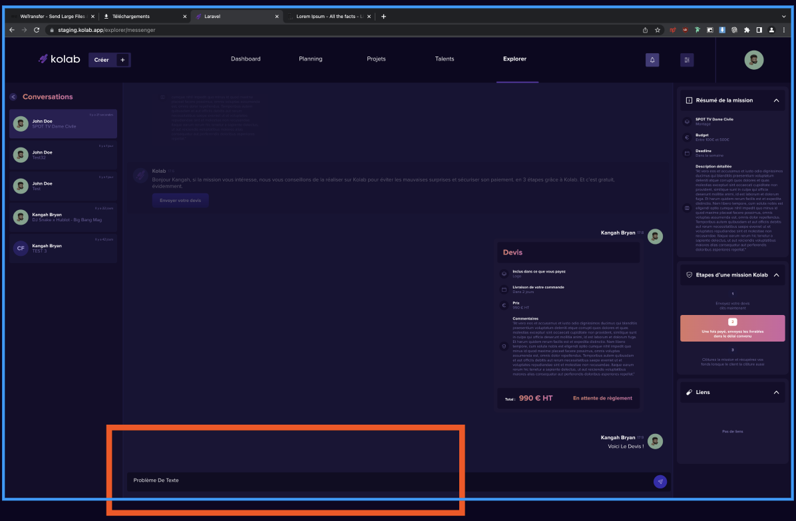
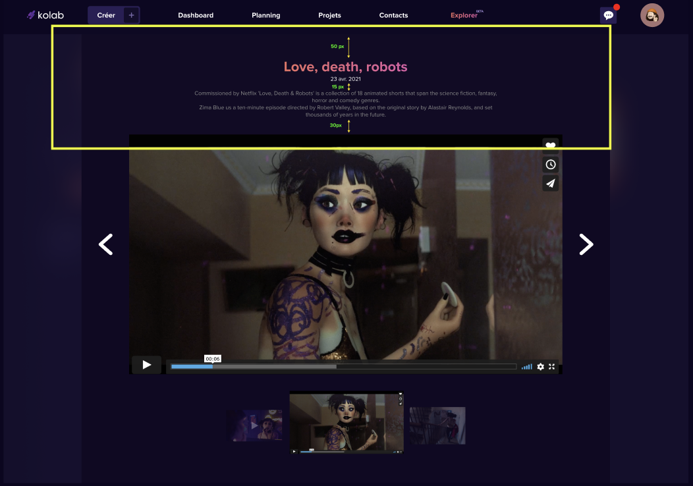

#CONSIGNES

## SET UP PROJECT

-Cloner le projet à l'aide des commandes git.

-Créer une nouvelle branche en respectant la nomenclature feature/...(Nom_de_la_feature_créer)

-Créer le .env avec vos accès de connexion en base de donnée.

-Installer composer : https://getcomposer.org/download/ , exécuter les commandes donner sur cette page

-Exécuter les commandes : Composer install -> npm i -> php artisan key:generate -> php artisan migrate

Une fois le projet installer, c'est à toi de coder.

## Exercices à réaliser 

## MESSAGERIE  ---------------------------------

Dans un premier temps, créer deux utilisateurs sur kolab 

Explication sur l'accès à Explorer sera faite par Alexandre ou moi en fonction du début du test.

Une fois l'accès à Explorer effectuer, se rendre sur l'endpoint /explorer/messenger.

-Faire en sorte que dès la reception d'un nouveau message la conversation viennent à l'élément envoyé le plus récemment et empêcher le scroll de la page lors du défilement dans la conversation. 

-Tous les mots écrient dans le champs texte de la messagerie prennent une majuscule lors de l'écriture, corriger le bug. 

## PROFILE  ---------------------------------

-Sur l'endpoint explorer/profile, il faudra rectifier les marges et les mises en forme de la maquette et faire du responsive sur cette page.

------------------------------------ __BACKEND AND FRONTEND EXPERIENCE__ ------------------------------------

Pouvoir rajouter plusieurs lignes en cliquant sur le plus à l'édition de la prestation du devis et la modifier avant validation. 

Fermer la pop up en cliquant dans la partie extérieur à la fenêtre.

Créer une pop up de confirmation de discard de la pop up ouverte.

Créer les messages d'erreurs lors d'une mauvaise saisie ou lorsqu'un champ n'est pas renseigné.

## PROFILE CARROUSEL  ---------------------------------

__Bonus__:

N'hésite pas à créer des animations sur cette messagerie fais preuve de créativité ;)

Si tu as la moindre question n'hésites pas à nous contacter pour que l'on puisse te donner des pistes sur le developpement.

Bon courage.

